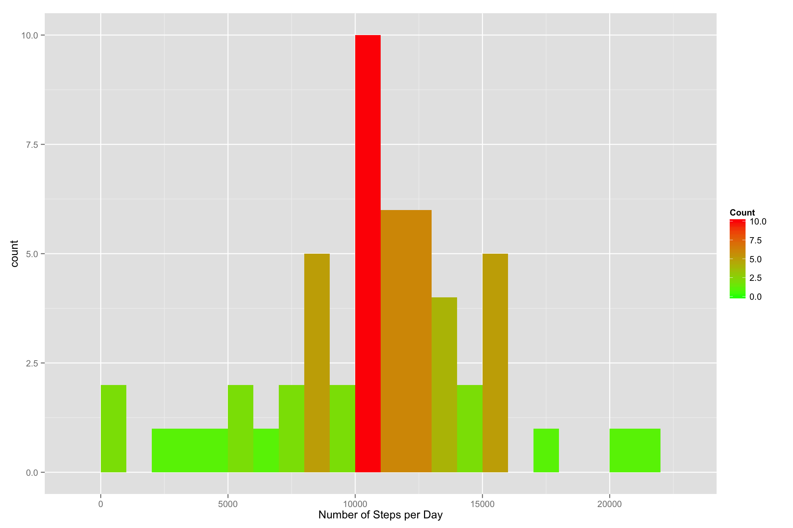
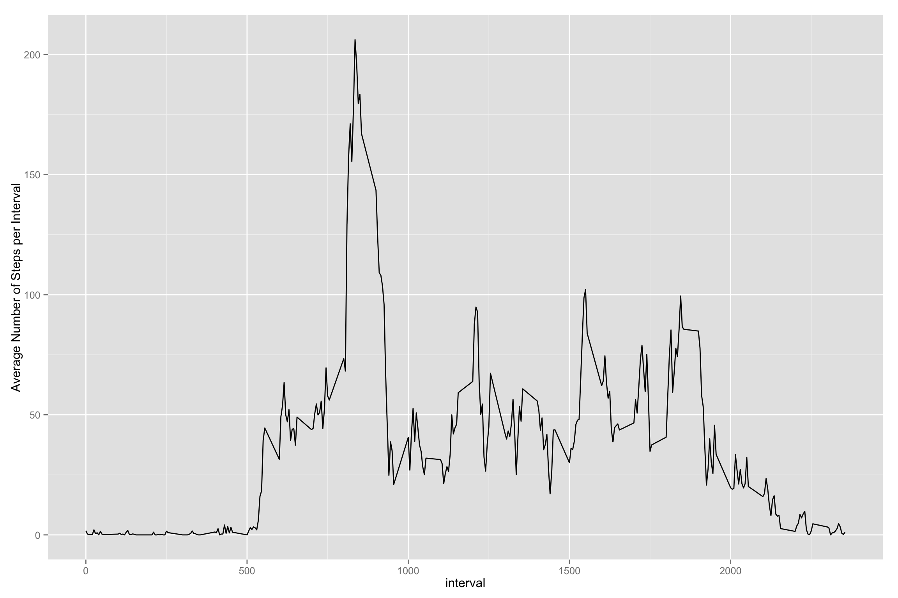
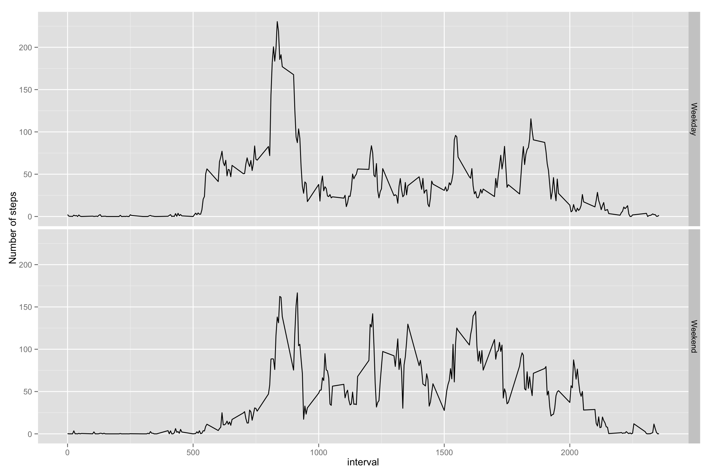

In the Peer Assessment 1, ggplot2 is used as plotting system, and dplyr is used for data processing amd wrangling.


```r
library(ggplot2)
library(dplyr)
```

First, the zipped CSV file is loaded and assigned to data frame which contains orginal records and NA values are omitted.


```r
df <- read.csv(unz("activity.zip", "activity.csv"), sep =",")
df <- na.omit(df)
```

#### Question #1: What is mean total number of steps taken per day?
> 1. For this part of the assignment, you can ignore the missing values in the dataset.
> 2. Calculate the total number of steps taken per day
> 3. If you do not understand the difference between a histogram and a barplot, research the difference between them. Make a histogram of the total number of steps taken each day
> 4. Calculate and report the mean and median of the total number of steps taken per day

For question #1, I use group_by() and summarise() functions from dplyr to get daily number of steps. The histogram is generated by ggplot2 with binwidth = 1000.


```r
stepsByDay <- group_by(df, date)
stepsByDay <- summarise(stepsByDay, steps_per_day = sum(steps))

ggplot(stepsByDay, aes(x = steps_per_day)) + geom_histogram(aes(fill = ..count..), binwidth = 1000) + xlab("Number of Steps per Day") + scale_fill_gradient("Count", low = "green", high = "red")
```

 

Calculate mean and median from the summarized data frame. Mean and median are slightly different.


```r
mean(stepsByDay$steps_per_day)
```

```
## [1] 10766.19
```

```r
median(stepsByDay$steps_per_day)
```

```
## [1] 10765
```

#### Question #2: What is the average daily activity pattern?
> 1. Make a time series plot (i.e. type = "l") of the 5-minute interval (x-axis) and the average number of steps taken, averaged across all days (y-axis)
> 2. Which 5-minute interval, on average across all the days in the dataset, contains the maximum number of steps?

For question #2, group_by() and summarise() functions from dplyr are used to generate average steps per interval. The time series plot is generated by ggplot2.


```r
stepsByInterval <- group_by(df, interval)
avgStepsByInterval <- summarise(stepsByInterval, steps_per_interval = mean(steps))
ggplot(avgStepsByInterval, aes(x = interval, y = steps_per_interval)) + geom_line() + ylab("Average Number of Steps per Interval")
```

 

To get max number of steps, I use arrnage() function from dplyr, sort steps records in descending order, and get max number from the first record.


```r
arrange(avgStepsByInterval, desc(steps_per_interval))[1,]$interval
```

```
## [1] 835
```

#### Question #3: Imputing missing values
> 1. Calculate and report the total number of missing values in the dataset (i.e. the total number of rows with NAs)
> 2. Devise a strategy for filling in all of the missing values in the dataset. The strategy does not need to be sophisticated. For example, you could use the mean/median for that day, or the mean for that 5-minute interval, etc.
> 3. Create a new dataset that is equal to the original dataset but with the missing data filled in.
> 4. Make a histogram of the total number of steps taken each day and Calculate and report the mean and median total number of steps taken per day. Do these values differ from the estimates from the first part of the assignment? What is the impact of imputing missing data on the estimates of the total daily number of steps?

Reload the orginal CSV file and keep all records, including NA values.


```r
df <- read.csv(unz("activity.zip", "activity.csv"), sep =",")
```

Get total number of missing values in the dataset.


```r
sum(is.na(df$steps))
```

```
## [1] 2304
```

Mean for that 5-minute interval is filled to missing values. The rest lines of code are almost the same as in question #1. 


```r
for (i in 1:nrow(df)) {
  if (is.na(df[i, ]$steps)) {
    df[i, ]$steps <- avgStepsByInterval[df[i, ]$interval == avgStepsByInterval$interval,]$steps_per_interval
  }
}

stepsByDay <- group_by(df, date)
stepsByDay <- summarise(stepsByDay, steps_per_day = sum(steps))

ggplot(stepsByDay, aes(x = steps_per_day)) + geom_histogram(aes(fill = ..count..), binwidth = 1000) + xlab("Number of Steps per Day (Imputed)") + scale_fill_gradient("Count", low = "green", high = "red")
```

-1.png) 

Calculate mean and median and find that mean is equal to median.


```r
mean(stepsByDay$steps_per_day)
```

```
## [1] 10766.19
```

```r
median(stepsByDay$steps_per_day)
```

```
## [1] 10766.19
```

#### Question #4: Are there differences in activity patterns between weekdays and weekends?
> For this part the weekdays() function may be of some help here. Use the dataset with the filled-in missing values for this part.
> 1. Create a new factor variable in the dataset with two levels – “weekday” and “weekend” indicating whether a given date is a weekday or weekend day.
> 2. Make a panel plot containing a time series plot (i.e. type = "l") of the 5-minute interval (x-axis) and the average number of steps taken, averaged across all weekday days or weekend days (y-axis).

Several new fields are added to the dataset. Use weekdays() function to find if the given date is weekday or weekend, find out if the steps are taken in weekday or weekend. From the time series plots we can find different patterns between weekdays and weekends.


```r
df$date <- as.Date(df$date)
df$days <- weekdays(df$date)
weekdays <- c('Monday', 'Tuesday', 'Wednesday', 'Thursday', 'Friday')
df$day_type <- as.factor(ifelse(df$days %in% weekdays, 'Weekday', 'Weekend'))

aggdata <- aggregate(steps ~ interval + day_type, df, mean)
ggplot(aggdata, aes(x = interval, y = steps)) + ylab("Number of steps") + geom_line() + facet_grid(day_type ~ .)
```

 
